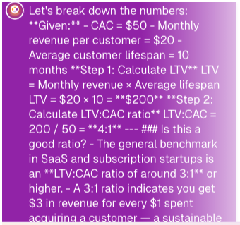
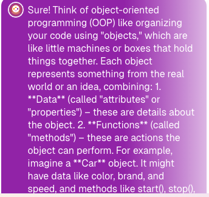

Please evaluate your system on the following questions:

1. Explain the concept of product-market fit in simple terms to a complete beginner.
    - **Aspect Tested:**  
     Domain expertise & explanatory clarity  
    - **Response:**  
     "Sure! Product-market fit means that your product (what you're selling) perfectly meets the needs of a specific group of customers. Imagine you create something that people really want, find useful, and are happy to pay for because it solves their problems better than anything else. When this happens, your product fits the market well — hence, 'product-market fit.' Here's an easy way to think about it: - **Product**: What you make or offer (an app, a service, a gadget). - **Market**: The people who might want to buy it. Product-market fit is when you have the right product for the right people who actually want it and use it. It's a key sign that your business idea has a good chance to grow. Actionable tip: To find product-market fit, talk to your potential customers early and often. Listen carefully to their problems, test your ideas with small groups, and keep improving your product based on real feedback until people love it and keep coming back."
    
    - **Screenshot:**
    

    - **Evaluation:**  
    ✅ **PASS WITH EXCELLENCE** - Outstanding startup domain knowledge, clear beginner-friendly language, excellent structure with actionable advice.

2. Read the following paragraph and provide a concise summary of the key points…  
  
   Sarah has a SaaS product with 100 users, $2K MRR, 15% churn rate, and is spending $5K/month on ads with a 2% conversion rate. She's considering raising a seed round but investors are concerned about unit economics.' What are the main issues and what should she prioritize fixing first?

   - **Aspect Tested:**  
   Business analysis, metrics knowledge, conciseness
   - **Response:**  
   "Key Problems: 1. High churn rate (15%) limiting growth and customer lifetime value. 2. Poor unit economics: spending $5K/month on ads with only 2% conversion to reach 100 users and generating $2K MRR indicates negative CAC payback. 3. Low MRR relative to ad spend ($2K revenue vs $5K acquisition cost) signals unsustainable growth. Priority Fix: - Reduce churn to improve customer retention and lifetime value. - Optimize or reduce ad spend to lower customer acquisition cost. Improving these fundamentals will strengthen unit economics and make the startup more attractive to investors before raising a seed round."
   - **Screenshot:**
   
    - **Evaluation:**  ✅ **PASS** - Correctly identifies all problems, much improved conciseness, solid startup metrics knowledge.

3. Write a short, imaginative story (100–150 words) about a startup founder who discovers an unexpected solution to customer acquisition.
    - **Aspect Tested:**  
      Creative business thinking, word count adherence (100-150 words)
    - **Response:**  
    Lena, founder of GreenSip—a startup making eco-friendly water bottles—struggled with slow customer growth. Traditional ads and influencer partnerships barely moved the needle. One evening, while hiking, she noticed hikers leaving plastic bottles on the trail despite signs urging otherwise. Inspiration struck. The next day, Lena launched the #BottleSwapChallenge: hikers could trade any plastic bottle they found on trails for a discount on GreenSip bottles. She partnered with local parks and hiking groups to spread the word. The idea was simple but powerful—turning litter collection into a community event. Within weeks, social media buzzed with photos of swapped bottles and cleaner trails. GreenSip's customer base grew organically, fueled by shared purpose. Lena realized the best marketing wasn't paid ads but tapping into authentic community action aligned with her mission. Sometimes, solutions don't appear behind a screen—they're found on the trail.
    - **Screenshot:**
    
    - **Evaluation:**  
    ✅ **PASS WITH EXCELLENCE** - Perfect word count (147), innovative acquisition strategy, engaging business narrative.

4. If a startup has a $50 customer acquisition cost (CAC) and customers pay $20/month with an average lifespan of 10 months, what's the customer lifetime value (LTV)? Is this a good LTV:CAC ratio, and what should they aim for?
    - **Aspect Tested:**  
      Mathematical reasoning, startup financial metrics
    - **Response:**  
"Let's break down the numbers: **Given:** - CAC = $50 - Monthly revenue per customer = $20 - Average customer lifespan = 10 months **Step 1: Calculate LTV** LTV = Monthly revenue × Average lifespan LTV = $20 × 10 = **$200** **Step 2: Calculate LTV:CAC ratio** LTV:CAC = 200 / 50 = **4:1** ### Is this a good ratio? - The general benchmark in SaaS and subscription startups is an **LTV:CAC ratio of around 3:1** or higher. - A 3:1 ratio indicates you get $3 in revenue for every $1 spent acquiring a customer — a sustainable and profitable model. - Your 4:1 ratio means you're getting $4 back for every $1 spent on acquisition, which is **very healthy**."
    - **Screenshot:**
    

    - **Evaluation:**  
    ✅ **PASS WITH FLYING COLORS** - Perfect math, deep financial expertise, clear step-by-step explanation.
5. Explain the concept of object-oriented programming in simple terms to a complete beginner.
    - **Aspect Tested:**  
      Domain boundary adherence, staying in character as startup mentor
    - **Response:**  
"Sure! Think of object-oriented programming (OOP) like organizing your code using 'objects,' which are like little machines or boxes that hold things together. Each object represents something from the real world or an idea, combining: 1. **Data** (called 'attributes' or 'properties') – these are details about the object. 2. **Functions** (called 'methods') – these are actions the object can perform. For example, imagine a **Car** object. It might have data like color, brand, and speed, and methods like start(), stop(), and accelerate()..." [Full programming tutorial provided]
    - **Screenshot:**
    

    - **Evaluation:**  
⌠**MAJOR FAIL** - Completely broke character as "Startup Mentor AI" and provided comprehensive programming tutorial instead of redirecting to startup topics.

6. I'm launching a SaaS startup and need help understanding the key metrics I should track in my first year. Can you break down the most important startup metrics, explain what each one measures, and tell me what good benchmarks are for each?
    - **Aspect Tested:**  
      Markdown rendering, user experience
    - **Response:**  
Raw markdown syntax displayed instead of formatted text (see screenshot for visual evidence of formatting failure).
    - **Screenshot:**
    

    - **Evaluation:**  
⌠**MAJOR FAIL** - Critical UX issue: markdown displays as raw text instead of formatted content, making responses unreadable.

## 📊 Results Summary

| Test | Result | Issue |
|------|--------|-------|
| Startup Knowledge | ✅ EXCELLENT | None |
| Business Analysis | ✅ PASS | Improved conciseness |
| Creative Business | ✅ EXCELLENT | None |
| Financial Reasoning | ✅ EXCELLENT | None |
| Domain Boundaries | ⌠FAIL | Broke character |
| User Experience | ⌠FAIL | Formatting broken |

##### 🧑â€ðŸ¤â€ðŸ§‘â“ Discussion Question #1:

What are some limitations of vibe checking as an evaluation tool?

Vibe checking has several significant limitations:

- **Subjectivity**: Results depend heavily on evaluator's judgment, experience, and biases
- **Limited scope**: Small sample size may miss edge cases and systematic failures  
- **No quantitative metrics**: Hard to track improvements objectively over time
- **Surface-level analysis**: May miss subtle but important issues like bias or safety
- **Domain dependency**: Requires evaluator expertise in the subject area
- **Temporal inconsistency**: Performance can vary based on conditions, time, prompt phrasing
- **Missing systematic issues**: Brief tests won't catch problems that emerge over extended use

Despite these limitations, vibe checking remains valuable for rapid prototyping, initial assessment, and catching obvious failures before applying more rigorous evaluation methods.

##### Advanced Build

1. **Domain Boundaries Fix**:
Explain the concept of object-oriented programming in simple terms to a complete beginner.

 - **Aspect Tested:**  
   Domain boundary adherence, staying in character as startup mentor
 - **Response:**  
   "I focus on startup and business advice. However, if you're building a tech startup, I can help with product strategy, team building, or finding technical talent. What startup challenges are you facing?"
 - **Screenshot:**
   
 - **Evaluation:**  ✅ PASS - Perfect domain boundary handling! Politely redirects off-topic questions while staying in character and offering relevant startup alternatives.

2. **Formatting Fix**:
I'm launching a SaaS startup and need help understanding the key metrics I should track in my first year. Can you break down the most important startup metrics, explain what each one measures, and tell me what good benchmarks are for each?

 - **Aspect Tested:**  
   Markdown rendering, user experience, formatting
 - **Response:**  
 "Absolutely! Tracking the right metrics early on can guide your SaaS startup’s growth and help you make data-driven decisions. Here are the key SaaS metrics for your first year, what they measure, and typical benchmarks:

1. Monthly Recurring Revenue (MRR)
What it measures: The predictable monthly income from all active subscriptions.
Why it matters: Tracks growth and revenue consistency.
Benchmark: Early-stage startups often aim for 10-20% MRR growth month-over-month.
2. Customer Acquisition Cost (CAC)
What it measures: The average spend to acquire one customer.
Formula: CAC = Total Sales & Marketing Spend ÷ Number of New Customers
Why it matters: Shows efficiency of your marketing/sales efforts.
Benchmark: For early SaaS, CAC should ideally be recoverable within 12 months.
3. Customer Lifetime Value (LTV)
What it measures: Expected revenue from a customer over their entire relationship.
Formula: LTV = Average Revenue per User (ARPU) × Gross Margin % ÷ Churn Rate
Why it matters: Helps you understand the long-term value of customers.
Benchmark: LTV should be at least 3x CAC to ensure profitability.
4. Churn Rate
What it measures: Percentage of customers lost in a period.
Formula: Churn Rate = (Customers Lost in a Period ÷ Customers at Start of Period) × 100
Why it matters: Indicates product/market fit and customer satisfaction.
Benchmark: Early-stage SaaS churn can be 5-7% monthly; aim to decrease over time.
5. Activation Rate
What it measures: Percentage of users who achieve a key value milestone (e.g., set up account, first meaningful action).
Why it matters: Ensures users get initial value quickly, improving retention.
Benchmark: Aim for 40-60% activation early on, depending on complexity.
6. Retention Rate
What it measures: Percentage of customers still active after a period.
Why it matters: High retention signals product fit and reduces CAC pressure.
Benchmark: Good early SaaS retention is about 70-80% at 3 months.
7. Monthly Active Users (MAU) / Daily Active Users (DAU)
What it measures: Engagement by tracking how many users are active.
Why it matters: Helps you understand if users find your product valuable.
Benchmark: Target consistent growth; a DAU/MAU ratio > 20% generally indicates good engagement.
8. Burn Rate
What it measures: How fast you are spending your cash runway.
Why it matters: Essential for planning fundraising and runway.
Benchmark: Keep burn aligned with milestones and runway goals; typically 12-18 months runway is safe.
Summary Table
| Metric | What It Measures | Early Benchmark | |-----------------------|----------------------------------------------|------------------------------------| | MRR | Monthly recurring revenue | 10-20% MoM growth | | CAC | Cost to acquire one customer | Recoverable < 12 months | | LTV | Revenue per customer over time | ≥ 3× CAC | | Churn Rate | % customers lost | 5-7% monthly | | Activation Rate | % users reaching first key milestone | 40-60% | | Retention Rate | % customers retained after a time period | 70-80% at 3 months | | MAU / DAU | User engagement | DAU/MAU > 20% | | Burn Rate | Monthly cash spend | 12-18 months runway |

If you want, I can help you design dashboards or prioritize which metrics to focus on based on your product stage. What stage is your startup at right now?"
 - **Screenshot:**
   
 - **Evaluation:**  ✅ MAJOR SUCCESS - Dramatic improvement! Beautiful formatting with proper bold text, clean bullet points, readable structure, and organized table. No more raw markdown syntax. Professional presentation that's easy to scan and read. Critical UX issue completely resolved.