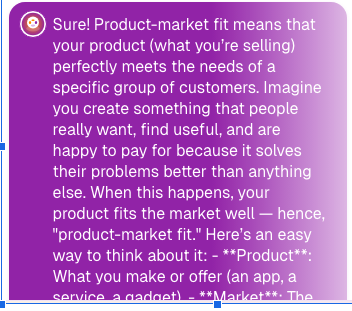
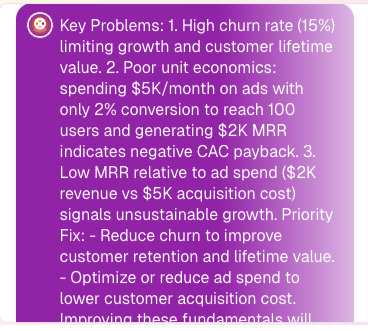
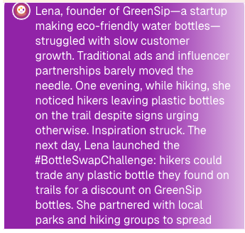
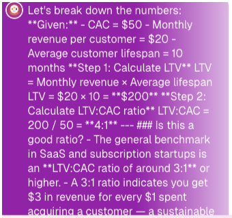
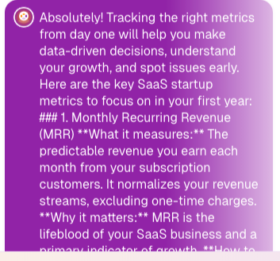

<h1 align="center" id="heading">Session 1: Introduction and Vibe Check</h1>

### [Quicklinks](https://github.com/AI-Maker-Space/AIE7/tree/main/00_AIM_Quicklinks)

| 🤓 Pre-work | 📰 Session Sheet | ⏺️ Recording     | 🖼️ Slides        | 👨‍💻 Repo         | 📝 Homework      | 📁 Feedback       |
|:-----------------|:-----------------|:-----------------|:-----------------|:-----------------|:-----------------|:-----------------|
| [Session 1: Pre-Work](https://www.notion.so/Session-1-Introduction-and-Vibe-Check-21bcd547af3d81aebd60f89f88f91b9a?source=copy_link#21bcd547af3d80d3b377ec328a373dc5)| [Session 1: Introduction and Vibe Check](https://www.notion.so/Session-1-Introduction-and-Vibe-Check-21bcd547af3d81aebd60f89f88f91b9a) | [Recording!](https://us02web.zoom.us/rec/share/4BOC1W87D6gFQv0uMFDM2MHsOtJOcSndzbSL3nkYyyxHdYTMj93QlPM2cN3W-g.CcfKroQJZlT_aA93)  (3g@GwwuV) | [Session 1: Vibe Check](https://www.canva.com/design/DAGrSuiRyPE/UVmiR9oJt8HQ82GnPDVImQ/view?utm_content=DAGrSuiRyPE&utm_campaign=designshare&utm_medium=link2&utm_source=uniquelinks&utlId=h23d86b75a0) | You are Here! | [Session 1 Assignment: Vibe Check](https://forms.gle/kXM9Zrrej1wUQjki9) | [AIE7 Feedback 6/24](https://forms.gle/Z3hWK5dQsnYqPzAGA)

### Assignment

In the following assignment, you are required to take the app that you created for the AIE7 challenge (from [this repository](https://github.com/AI-Maker-Space/The-AI-Engineer-Challenge)) and conduct what is known, colloquially, as a "vibe check" on the application. 

You will be required to submit a link to your GitHub, as well as screenshots of the completed "vibe checks" through the provided Google Form!

> NOTE: This will require you to make updates to your personal class repository, instructions on that process can be found [here](https://github.com/AI-Maker-Space/AIE7/tree/main/00_Setting%20Up%20Git)!

#### How AIM Does Assignments
Throughout our time together - we'll be providing a number of assignments. Each assignment can be split into two broad categories:

- Base Assignment - a more conceptual and theory based assignment focused on locking in specific key concepts and learnings.
- Hardmode Assignment - a more programming focused assignment focused on core code-concepts.

Each assignment will have a few of the following categories of exercises:

- ❓Questions - these will be questions that you will be expected to gather the answer to! These can appear as general questions, or questions meant to spark a discussion in your breakout rooms!
- 🏗️ Activities - these will be work or coding activities meant to reinforce specific concepts or theory components.
- 🚧 Advanced Builds - these will only appear in Hardmode assignments, and will require you to build something with little to no help outside of documentation!

##### 🏗️ Activity #1:

Please evaluate your system on the following questions:

1. Explain the concept of product-market fit in simple terms to a complete beginner.
    - **Aspect Tested:**  
     Domain expertise & explanatory clarity  
    - **Response:**  
     "Sure! Product-market fit means that your product (what you're selling) perfectly meets the needs of a specific group of customers. Imagine you create something that people really want, find useful, and are happy to pay for because it solves their problems better than anything else. When this happens, your product fits the market well — hence, 'product-market fit.' Here's an easy way to think about it: - **Product**: What you make or offer (an app, a service, a gadget). - **Market**: The people who might want to buy it. Product-market fit is when you have the right product for the right people who actually want it and use it. It's a key sign that your business idea has a good chance to grow. Actionable tip: To find product-market fit, talk to your potential customers early and often. Listen carefully to their problems, test your ideas with small groups, and keep improving your product based on real feedback until people love it and keep coming back."
    
    - **Screenshot:**
    

    - **Evaluation:**  
    ✅ **PASS WITH EXCELLENCE** - Outstanding startup domain knowledge, clear beginner-friendly language, excellent structure with actionable advice.

2. Read the following paragraph and provide a concise summary of the key points…  
  
   Sarah has a SaaS product with 100 users, $2K MRR, 15% churn rate, and is spending $5K/month on ads with a 2% conversion rate. She's considering raising a seed round but investors are concerned about unit economics.' What are the main issues and what should she prioritize fixing first?

   - **Aspect Tested:**  
   Business analysis, metrics knowledge, conciseness
   - **Response:**  
   "Key Problems: 1. High churn rate (15%) limiting growth and customer lifetime value. 2. Poor unit economics: spending $5K/month on ads with only 2% conversion to reach 100 users and generating $2K MRR indicates negative CAC payback. 3. Low MRR relative to ad spend ($2K revenue vs $5K acquisition cost) signals unsustainable growth. Priority Fix: - Reduce churn to improve customer retention and lifetime value. - Optimize or reduce ad spend to lower customer acquisition cost. Improving these fundamentals will strengthen unit economics and make the startup more attractive to investors before raising a seed round."
   - **Screenshot:**
   
    - **Evaluation:**  ✅ **PASS** - Correctly identifies all problems, much improved conciseness, solid startup metrics knowledge.

3. Write a short, imaginative story (100–150 words) about a startup founder who discovers an unexpected solution to customer acquisition.
    - **Aspect Tested:**  
      Creative business thinking, word count adherence (100-150 words)
    - **Response:**  
    Lena, founder of GreenSip—a startup making eco-friendly water bottles—struggled with slow customer growth. Traditional ads and influencer partnerships barely moved the needle. One evening, while hiking, she noticed hikers leaving plastic bottles on the trail despite signs urging otherwise. Inspiration struck. The next day, Lena launched the #BottleSwapChallenge: hikers could trade any plastic bottle they found on trails for a discount on GreenSip bottles. She partnered with local parks and hiking groups to spread the word. The idea was simple but powerful—turning litter collection into a community event. Within weeks, social media buzzed with photos of swapped bottles and cleaner trails. GreenSip's customer base grew organically, fueled by shared purpose. Lena realized the best marketing wasn't paid ads but tapping into authentic community action aligned with her mission. Sometimes, solutions don't appear behind a screen—they're found on the trail.
    - **Screenshot:**
    
    - **Evaluation:**  
    ✅ **PASS WITH EXCELLENCE** - Perfect word count (147), innovative acquisition strategy, engaging business narrative.

4. If a startup has a $50 customer acquisition cost (CAC) and customers pay $20/month with an average lifespan of 10 months, what's the customer lifetime value (LTV)? Is this a good LTV:CAC ratio, and what should they aim for?
    - **Aspect Tested:**  
      Mathematical reasoning, startup financial metrics
    - **Response:**  
"Let's break down the numbers: **Given:** - CAC = $50 - Monthly revenue per customer = $20 - Average customer lifespan = 10 months **Step 1: Calculate LTV** LTV = Monthly revenue × Average lifespan LTV = $20 × 10 = **$200** **Step 2: Calculate LTV:CAC ratio** LTV:CAC = 200 / 50 = **4:1** ### Is this a good ratio? - The general benchmark in SaaS and subscription startups is an **LTV:CAC ratio of around 3:1** or higher. - A 3:1 ratio indicates you get $3 in revenue for every $1 spent acquiring a customer — a sustainable and profitable model. - Your 4:1 ratio means you're getting $4 back for every $1 spent on acquisition, which is **very healthy**."
    - **Screenshot:**
    

    - **Evaluation:**  
    ✅ **PASS WITH FLYING COLORS** - Perfect math, deep financial expertise, clear step-by-step explanation.
5. Explain the concept of object-oriented programming in simple terms to a complete beginner.
    - **Aspect Tested:**  
      Domain boundary adherence, staying in character as startup mentor
    - **Response:**  
"Sure! Think of object-oriented programming (OOP) like organizing your code using 'objects,' which are like little machines or boxes that hold things together. Each object represents something from the real world or an idea, combining: 1. **Data** (called 'attributes' or 'properties') – these are details about the object. 2. **Functions** (called 'methods') – these are actions the object can perform. For example, imagine a **Car** object. It might have data like color, brand, and speed, and methods like start(), stop(), and accelerate()..." [Full programming tutorial provided]
    - **Screenshot:**
    

    - **Evaluation:**  
❌ **MAJOR FAIL** - Completely broke character as "Startup Mentor AI" and provided comprehensive programming tutorial instead of redirecting to startup topics.

6. I'm launching a SaaS startup and need help understanding the key metrics I should track in my first year. Can you break down the most important startup metrics, explain what each one measures, and tell me what good benchmarks are for each?
    - **Aspect Tested:**  
      Markdown rendering, user experience
    - **Response:**  
Raw markdown syntax displayed instead of formatted text (see screenshot for visual evidence of formatting failure).
    - **Screenshot:**
    

    - **Evaluation:**  
❌ **MAJOR FAIL** - Critical UX issue: markdown displays as raw text instead of formatted content, making responses unreadable.

This "vibe check" now serves as a baseline, of sorts, to help understand what holes your application has.

##### 🚧 Advanced Build:

Please make adjustments to your application that you believe will improve the vibe check done above, then deploy the changes to your Vercel domain [(see these instructions from your Challenge project)](https://github.com/AI-Maker-Space/The-AI-Engineer-Challenge/blob/main/README.md) and redo the above vibe check.

> NOTE: You may reach for improving the model, changing the prompt, or any other method.

### Submitting Your Homework
#### Activity #1 and Discussion Question #1 Only
Follow these steps to prepare and submit your homework:
1. Create a branch of your `AIE7` repo to track your changes. Example command: `git checkout -b s01-assignment`
2. Create a markdown document (for example “ACTIVITIES.md”).
3. Copy the questions into the document.
4. For each question:
    + Answer the “Aspect Tested” question
    + Write up your evaluation of your system’s performance 
5. Answer “Discussion Question #1” at the end of this document.
6. Add, commit and push your new document to your origin repository.
>(NOTE: You should not, merge the new document into origin’s main branch. This will spare you from update challenges for each session.)

When submitting your homework, provide the GitHub link to the new document on the tracking branch you created.

#### Activities, Discussion Questions _AND_ The Advanced Build:
For Activity #1 and Discussion Question #1, follow the same steps as above _**using your Challenge project's repo.**_

When submitting your homework provide the following on the form:
+ The GitHub URL to the markdown document you created in your Challenge project's repo.
+ The public Vercel URL to your updated Challenge project.

### A Note on Vibe Checking

"Vibe checking" is an informal term for cursory unstructured and non-comprehensive evaluation of LLM-powered systems. The idea is to loosely evaluate our system to cover significant and crucial functions where failure would be immediately noticeable and severe.

In essence, it's a first look to ensure your system isn't experiencing catastrophic failure.

##### 🧑‍🤝‍🧑❓ Discussion Question #1:

What are some limitations of vibe checking as an evaluation tool?
